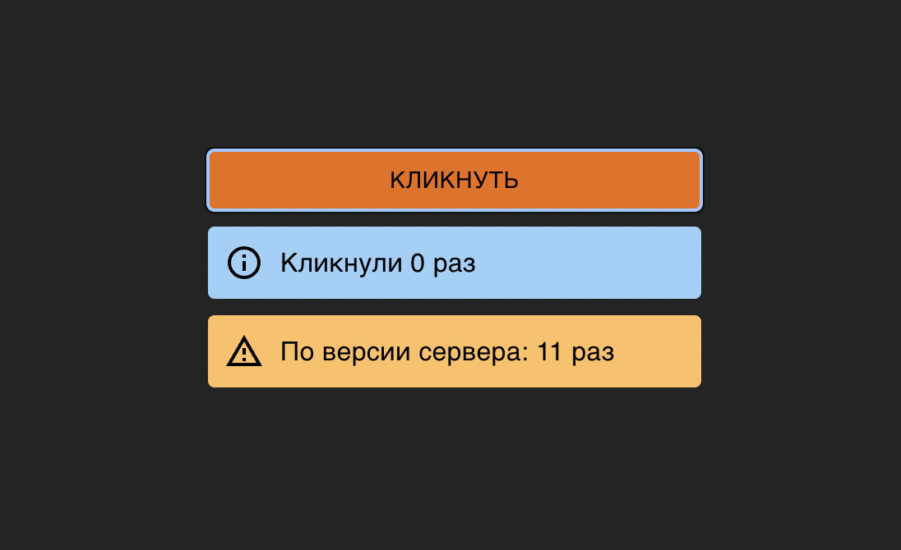

# Проект [ApiClicker](https://github.com/AlexFromNorth/ApiClicker) | Frontend / Api
### 📜 Описание:
Single Page Application созданная с Vite. Реализован кликер отправляющие данные на Api и ожидающий ответа.


### ⚙️ Условия задания:
* Приложение имеет кнопку Кликнуть и умеет отправлять количество кликов на сервер.

* Пользователь n-раз нажимает на кнопку, количество нажатий суммирается 1 секунду, затем отправляется запрос. Если в течении 1 секунды на кнопку опять нажали, таймер перезапускается. 

* Механизм отправки запроса реализовать через custom hook (без использования Redux и подобных).

* Во время ожидания ответа от сервера кнопку необходимо заблокировать и показать загрузку.

* Ответ от сервера изобразить отдельным компонентом.

* Учесть, что от сервера может прийти ошибка. Использование библиотеки mui приветствуется.


### 🥞 Стек:

`HTML5` `CSS3` `JavaScript ES6+` `React` `Material UI` `TypeScript` `axios`

### 💽 Установка и запуск:

1. Склонировать репозиторий в текущую папку:

```git clone https://github.com/AlexFromNorth/ApiClicker.git ```

2. Установить зависимости:

```yarn install```

3. Запустить проект в режиме разработки:

```yarn run dev или yarn start```
<br />
<br />


